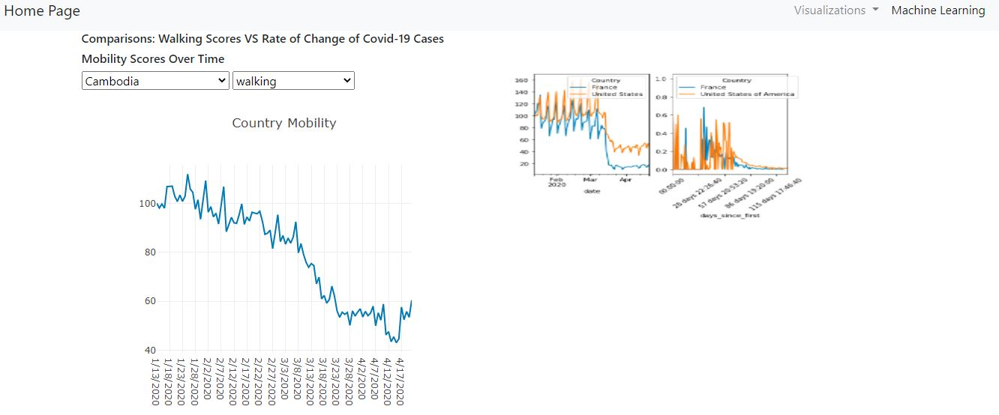

# Covid-Mobility

The relationship between mobility and covid-19 during QI of 2020 was investigated. We wanted to figure out whether subsequent shutdowns have affected people's mobility in different cities and countries around the world.

# Technologies Used:

Pandas, Python, Flask, SQL, Postgres, HTML, JavaScript, CSS, Plotly, Git, Github

# How to Run Code

1) Copy and paste this link https://final-covid-mobility.herokuapp.com/ into your browser

2) Enjoy!

# Data

- Mobility data was extracted from Apple in a csv. Mobility scores were given out of 100 depending on how frequently transit options (walking,driving,biking), would be searched in Apple Maps. 

- Covid-19 data was extracted from WHO also in csv format.

# Data cleaning, manipulation, and application development process:

- Mobility data was manipulated in pandas to be in first normal form.
- Mobility data was inserted into a Postgres database.
- A connection was established in Flask to serve up the mobility data
- to our javascript file
- A route to our html was established using Flask
- Graphs were created using plotly to demonstrate mobility trends over time in various countries

# Machine Learning:

Polynomial Graphs:

- Graphed each country by the length of the list (ie number of days) on the x-axis and cumulative cases on the y-axis in a 3rd-degree polynomial
- Used this model to be able to determine the number of days it would take to flatten the curve in different countries

Scatter Plots:

-Used growth rates and different transit types to try to predict the growth rate of the pandemic via transit, driving, and walking scores.
-Not a strong correlation found in current model.

# Screenshots

. Shows the trend among mobility data in various countries prior to the Covid-19 lockdown and afterwards. I wanted to demonstrate a decreasing trend over time and therefore, chose this interactive line chart. 

# Conclusions
- Determined the number of days it takes to flatten the coronavirus curve in various countries with existing data.
- Did not make a prediction as to how transit, driving, and biking scores can predict the growth of the pandemic.
